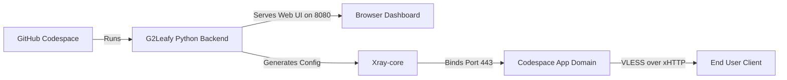

<div align="center">

# G2rayXCodeLeafy

A sleek **web dashboard** for managing Xray VLESS xHTTP configs on GitHub Codespaces.

[](https://github.com/Code-Leafy/G2rayXCodeLeafy)
[](https://github.com/Code-Leafy/G2rayXCodeLeafy)
[](https://github.com/Code-Leafy/G2rayXCodeLeafy)

</div>

---
<div align="center">
<!-- 📸 Panel Preview Image -->


</div>

<br>

## Overview

G2rayXCodeLeafy is a powerful, interactive **web panel dashboard** designed to instantly deploy and manage Xray VLESS xHTTP configurations. Built specifically for the GitHub Codespaces environment, it automates port management, client creation, subscription generation, traffic monitoring, and connection controls through a modern browser-based UI.

Once the Python backend starts, it serves a full dashboard on the forwarded Codespaces web port. From there, you can manage clients, preview generated configs, copy subscription links, view logs, monitor usage, and control the Xray core without using a terminal UI.

> **Note:** The panel includes an optional background wake-lock/keepalive feature to help keep the Codespace active while the proxy is in use. Use this feature at your own risk and follow GitHub Codespaces usage policies.

---

<details open>
<summary><kbd>🔗</kbd> Community Donated Configs (SUB)</summary>

Want to use public nodes donated by other G2ray users? Import this subscription link directly into your V2ray/Xray client:

```text
https://raw.githubusercontent.com/Code-Leafy/G2rayXCodeLeafy/main/configs.txt
```

</details>

---

## Core Features

### ⚡ Web Dashboard Control Panel

Manage everything from a clean browser UI instead of a terminal/curses interface. Create clients, edit limits, view QR codes, copy subscription links, restart Xray, and monitor the system from one dashboard.

### 🔐 VLESS xHTTP Config Generation

Generate VLESS xHTTP client links and subscription outputs for GitHub Codespaces forwarding domains. The panel is designed around modern Xray clients and avoids deprecated insecure TLS options.

### 📡 Live Analytics & Quota

Tracks real-time RX/TX data consumption, connection status, Xray uptime, CPU/RAM usage, disk usage, and estimated Codespaces free-tier quota.

### 🧪 Subscription Lab

Build custom per-client subscription layouts directly in the web panel. Add proxy entries, info entries, placeholders, custom names, usage indicators, and live mobile-style previews.

### 🔄 Optional Wake Lock / Keepalive

Includes optional controls for keeping the runtime active while the service is in use. This can be toggled from the web dashboard.

### 📦 Community Config Network

Donate a generated config from the panel to share access with the community while keeping your personal clients separate.

<div align="center">

| 🛠️ Configuration Optimizer |
| :--- |
| To finalize your setup, take the config received from the panel and visit **[NetLeafy](https://code-leafy.github.io/NetLeafy)**. Set the server mode to **G2ray** and paste your link to generate a fully optimized connection. |

</div>

---

## 🚀 Quick Start

### 🌐 1. GitHub Codespaces (Browser / VS Code)

*No local installation required.*

1. **Fork the Repository**: Click **Fork** at the top-right of this GitHub page.
2. **Create a Codespace**: Open your fork → Click the green **Code** button → **Codespaces** tab → **Create codespace on main**.
3. **Wait for Environment**: Allow 1–2 minutes for the container to build.
4. **Launch Backend**: The `g2leafy.py` backend should start automatically in the integrated VS Code terminal.
5. **Open Web Dashboard**: Open the forwarded web port URL printed in the terminal. It will look similar to:

   ```text
   https://<your-codespace-name>-8080.app.github.dev/
   ```

---

## Usage

When launched, the backend prints your dashboard and Xray forwarding URLs in the terminal.

```bash
# If the backend does not start automatically for any reason, run:
python3 g2leafy.py
```

Then open the dashboard URL in your browser:

```text
https://<your-codespace-name>-8080.app.github.dev/
```

Inside the web dashboard, you can:

- View live traffic, speed, uptime, and hardware usage from **Dashboard**.
- Manage Codespaces region/IP/quota details from **Codespace Settings**.
- Create, edit, enable, disable, delete, and QR-share clients from **Client Profiles**.
- Build custom per-client subscriptions from **Subscription Lab**.
- Configure routing, DNS, sniffing, logging, and core options from **Advanced Settings**.
- View Xray and panel logs from **Console Logs**.

> Opening the Xray forwarded port directly in a browser may show `400`. That is normal for VLESS xHTTP. Use the generated VLESS or subscription link in a compatible client instead.

---

## Architecture



<details>

<summary><kbd>📁</kbd> Project Structure</summary>

```text
G2rayXCodeLeafy/
├── data/                    # Dynamic storage for usage stats, UUIDs, panel state, and configs
├── logs/                    # Xray and panel logs
├── assets/                  # Media resources, previews, and videos
├── configs.txt              # Community donated subscription configs
└── g2leafy.py               # Python backend, web dashboard server, and Xray manager
```

</details>

---

<details>

<summary><kbd>❓</kbd> FAQ & Troubleshooting</summary>

### Is this still a TUI/curses panel?

No. Current versions use a **web panel dashboard**. The terminal is only used to start the Python backend and print the dashboard URL.

### Where do I open the panel?

Open the forwarded web port, usually:

```text
https://<your-codespace-name>-8080.app.github.dev/
```

### Why do I see HTTP 404 on port 443?

That is expected. Port `443` is used by Xray VLESS xHTTP, not the web dashboard. Browsers send normal HTTP requests, while Xray expects xHTTP proxy traffic. Use the generated config in your V2ray/Xray client.

### My Codespace keeps shutting down. What can I do?

Open **Codespace Settings** in the dashboard and enable the optional wake-lock feature if you understand the risks. Make sure your usage complies with GitHub Codespaces policies.

### Why are my speeds slow?

For optimal routing, try setting your GitHub Codespace region to a nearby or well-connected region such as Europe West in your GitHub account settings.

### My client fails when insecure TLS is disabled.

Make sure the generated config uses the Codespaces forwarding domain for `sni` and `host`. Modern Xray versions removed deprecated `allowInsecure` behavior. The panel should generate configs without `allowInsecure` and rely on valid TLS verification for `*.app.github.dev`.

</details>

<br>

<div align="center">

> **⚠️ Educational Purpose Only:** This project is provided for educational and research purposes. Users are solely responsible for compliance with all local laws. The developer assumes no liability for misuse.

[MIT License](https://github.com/Code-Leafy/G2rayXCodeLeafy/blob/main/LICENSE) · Crafted by [Code-Leafy](https://github.com/Code-Leafy)

</div>
